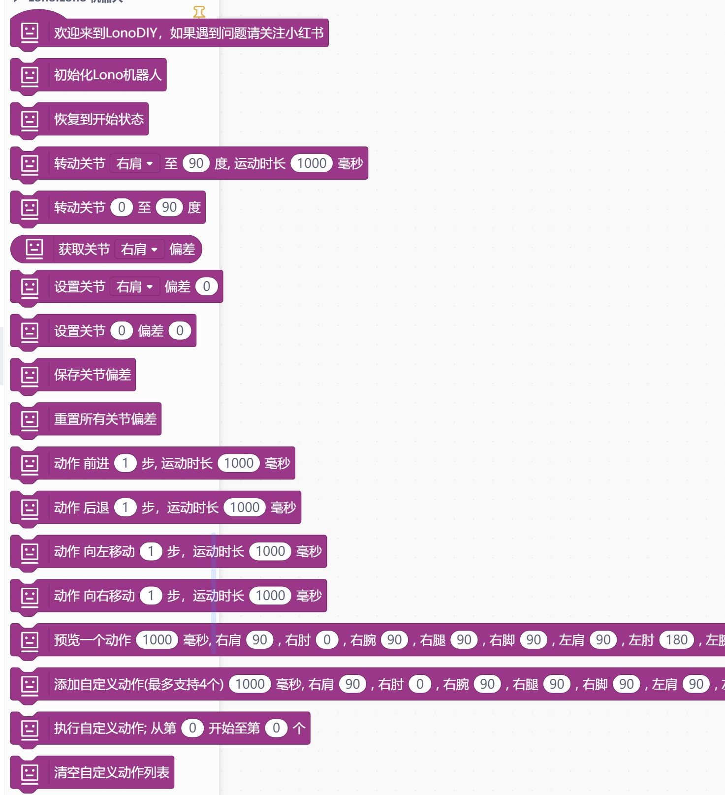
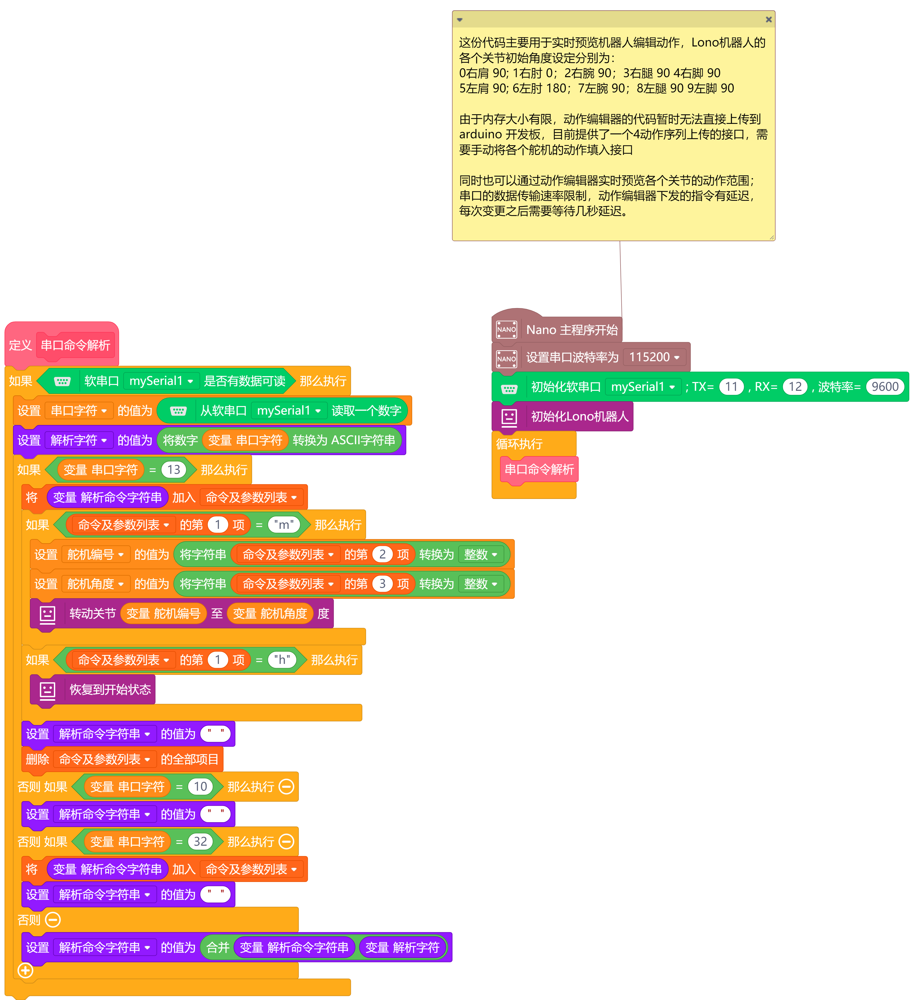

# Lono Robot Mind+ Extension


---------------------------------------------------------


## URL
* Project URL : ```https://github.com/LonoDIY/LonoMindPlusExt```

* Tutorial URL : It will be continuously improved subsequently, either in the form of videos or texts.

* If you are in China, you can follow my 小红书账号 [yy超爱玩]   


## Summary
The Lono project was mainly because I wanted to create a low-cost educational robot. Thanks to referring to the experiences of many similar open-source projects, I finally completed the Lono robot. Currently, Lono is a robot with Arduino nano as the main controller, combined with low-cost SG90 servo motors, and other low-cost hardware, such as 0.96-inch OLED screens, buzzers, and JDY-31 Bluetooth modules, which enables the Lono robot to have more gameplay options.

Some examples need to load the software serial port extension provided by Lono at the same time. The repository address is https://github.com/LonoDIY/LonoSoftwareSerial   

Example code and STL model files reference to repository https://github.com/LonoDIY/LonoCode

## Blocks




## Examples



## License

MIT

## Supported targets

MCU                | JavaScript    | Arduino   | MicroPython    | Remarks
------------------ | :----------: | :----------: | :---------: | -----
Arduino nano        |             |       √       |             | 


## Release Logs
* V0.0.1  Adapt to Arduino nano

# Problem   
1: The overall structure is slightly complex and needs to be simplified;   

2: The printing density is too high, resulting in the robot being a bit heavy overall. The filling degree needs to be adjusted to around 30%.   

3: Due to the overall weight, some movements of the robot cannot be presented perfectly. On the one hand, the filling degree should be reduced during printing. On the other hand, the foot servo can be replaced with MG90S for a try.   

4: Due to the limited memory and flash size of Arduino nano, many functions of Lono currently need to be used separately, such as Bluetooth control, action preview, deviation adjustment, etc.

# Plan   
1: Upgrade Arduino nano to ESP32   
2: Optimize the complexity of the 3D printing structure   
3: Provide more Mind+ examples
