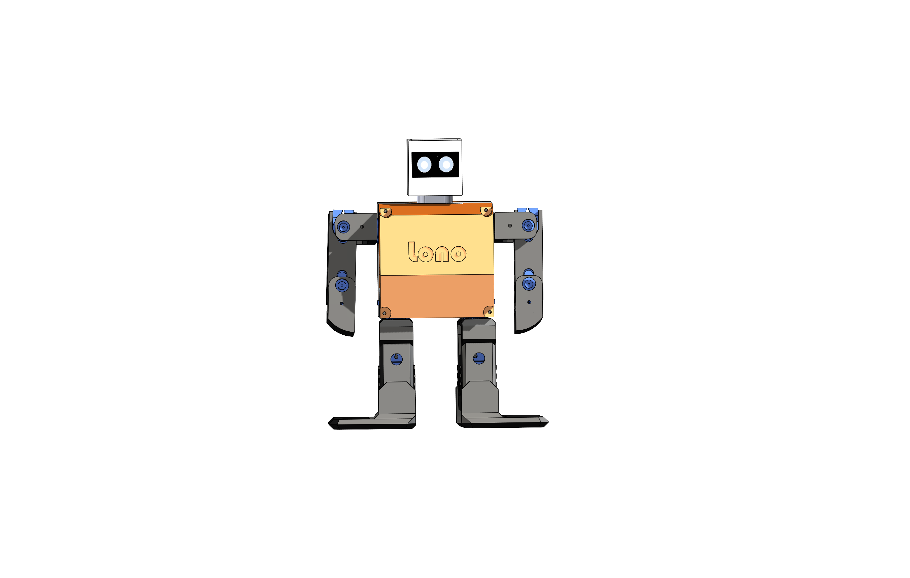
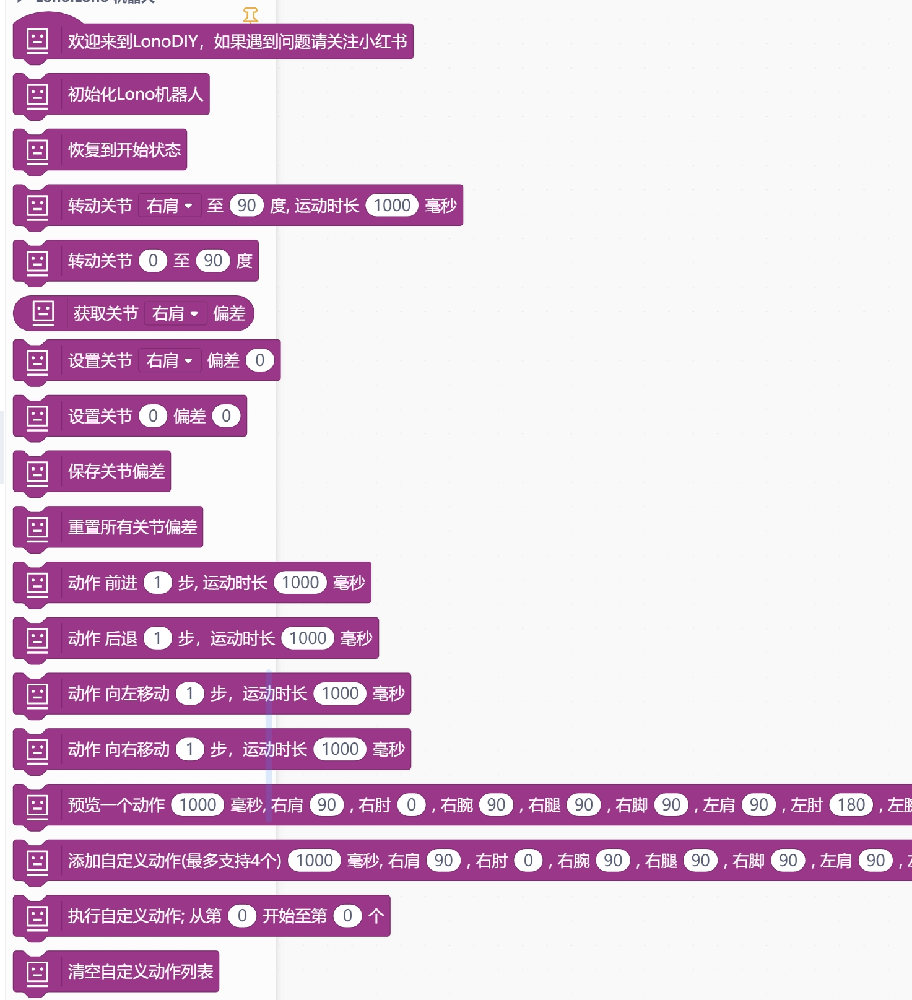
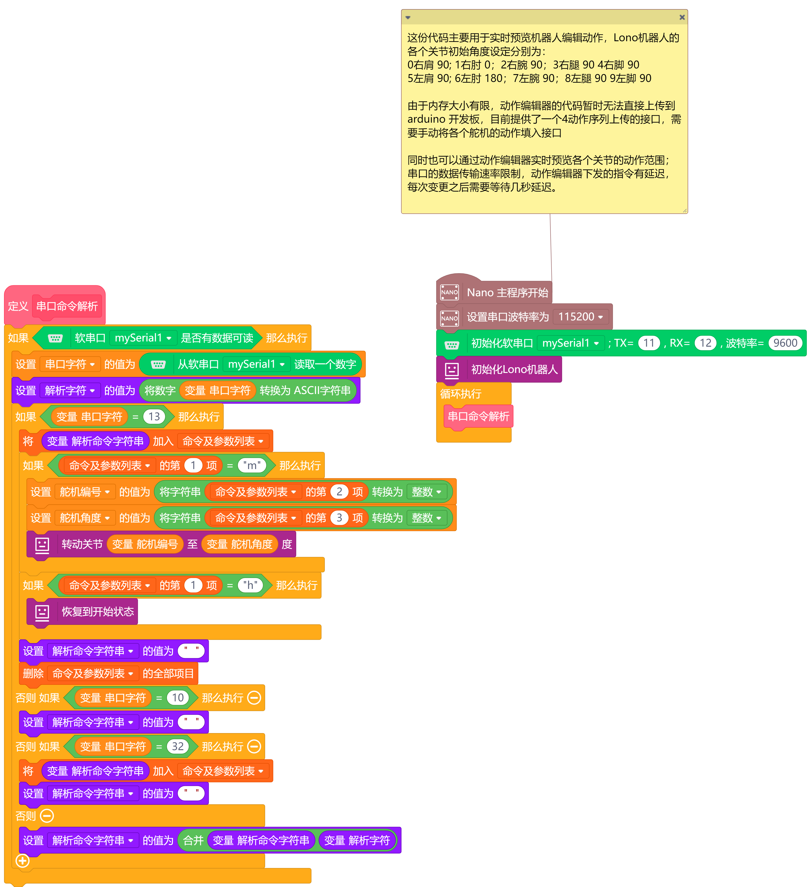

# Lono 机器人 Mind+ 扩展



---------------------------------------------------------

## URL
* 项目 URL ： ```https://github.com/LonoDIY/LonoMindPlusExt```

* 教程 URL ：后续会陆续完善，以视频或者文字的形式。

* 如果您在中国，可以关注我的小红书账号 [yy 超爱玩]   


## 概述
Lono 这个项目主要是因为我想制作一个低成本的教育机器人。得益于参考许多类似开源项目的经验，我最终完成了 Lono 机器人。目前，Lono 是以 Arduino nano 作为主控制器，结合低成本的 SG90 舵机以及其他低成本硬件，如 0.96 英寸 OLED 屏幕、蜂鸣器和 JDY-31 蓝牙模块，这使得 Lono 机器人有更多的玩法。   

有的例子需要同时加载lono提供的软件串口扩展，仓库地址为 https://github.com/LonoDIY/LonoSoftwareSerial   

相关例子及模型文件请参考仓库 https://github.com/LonoDIY/LonoCode

## 模块



## 示例



## 许可证

MIT

## 支持的目标

微控制器 | JavaScript | Arduino | MicroPython | 备注
------------------ | :----------: | :----------: | :---------: | -----
Arduino nano        |             |       √       |             |  

## 发布日志
* V0.0.1  适配 Arduino nano

# 问题
1: 整体结构稍微有点复杂，需要简化；

2: 打印密度过大，导致机器人整体有点重，需要将填充度调节为 30%左右。

3: 由于整体重量的原因，机器人的有些动作并不能完美呈现。一方面是打印时降低填充度，另一方面是脚部舵机可以更换为 MG90S 尝试一下。

4: 由于 Arduino nano 的内存和闪存大小有限，目前 Lono 的许多功能需要拆分使用，比如蓝牙控制、动作预览、偏差调节等。

# 计划
1: 将 Arduino nano 升级为 ESP32
2: 优化 3D 打印结构复杂度
3: 提供更多的 Mind+ 例子